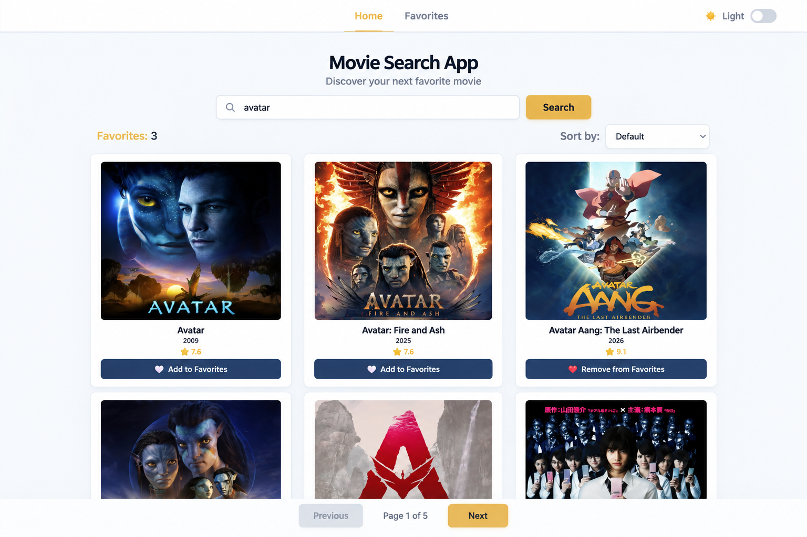
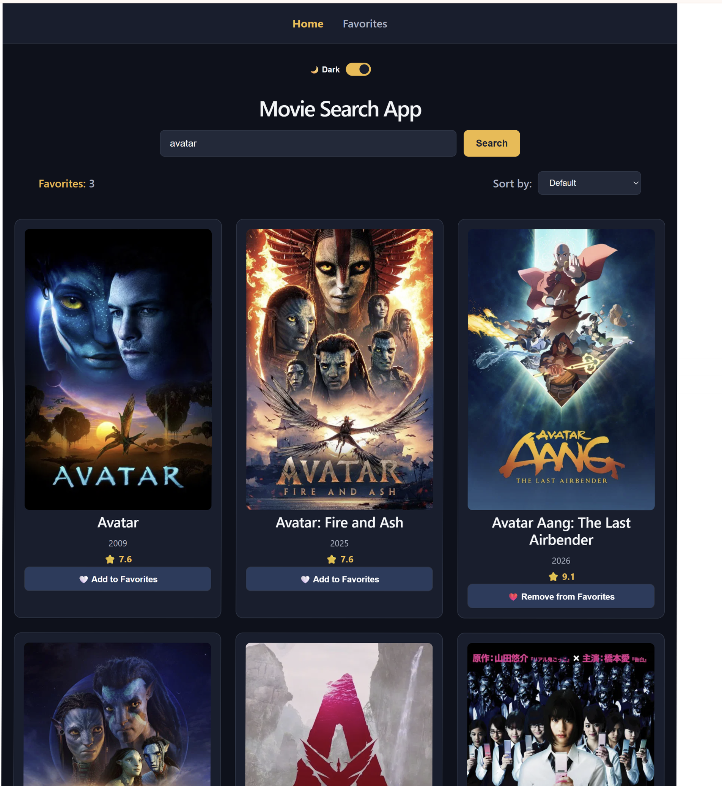
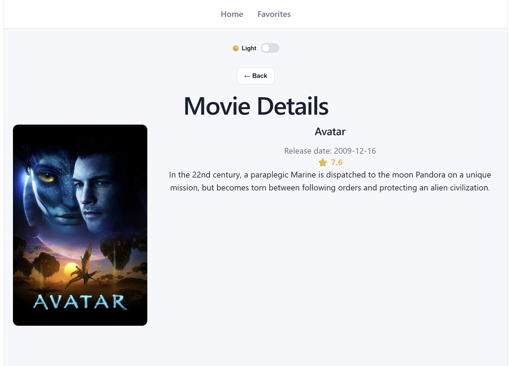

# 🎬 Movie Search App

A responsive movie search application built with React and TypeScript using the TMDB API.

## ✨ Features

- Search movies by title
- View movie details
- Add and remove favorite movies
- Save favorites in localStorage
- Sort movies by rating, release date, and title
- Pagination
- Light and Dark themes
- Theme preference saved in localStorage
- Responsive design for desktop, tablet, and mobile
- Loading, error, and empty states

## 🛠 Tech Stack

- React
- TypeScript
- Vite
- React Router
- TMDB API
- CSS
- localStorage
- Vercel

## 📸 Screenshots

### Light Theme



### Dark Theme



### Movie Details



## 🌐 Live Demo

[View Movie Search App](https://movie-search-app-omega-seven.vercel.app)

## 💻 Run Locally

Clone the repository:

```bash
git clone https://github.com/Inna-code10/movie-search-app.git
```

Go to the project directory:

```bash
cd movie-search-app
```

Install dependencies:

```bash
npm install
```

Create a `.env` file in the root directory and add your TMDB API token:

```env
VITE_TMDB_TOKEN=your_tmdb_token
```

Start the development server:

```bash
npm run dev
```

Open the local URL shown in the terminal in your browser.